# Demo: Azure App Service
This guide provides setup requirements and steps to demonstrate the concepts of the Azure App Service.  In this example you will deploy a local web app to the cloud, scale it and secure it using PaaS featuers.

## Contents
* [Pre-Requisites](#pre)
* [Setup](#setup)
* [Demo Steps](#demo)
* [Clean Up](#cleanup)

##  Pre-Requisites
1. Visual Studio 2015 or greater
2. Azure Subscription
3. [Azure .NET SDK](https://azure.microsoft.com/en-us/downloads/)

##  Setup
*Estimated time 5 minutes*

Purpose: setup a sample application that can be easily deployed to Azure App Service during the demo.

1. Open Visual Studio and select File -> New -> Project

    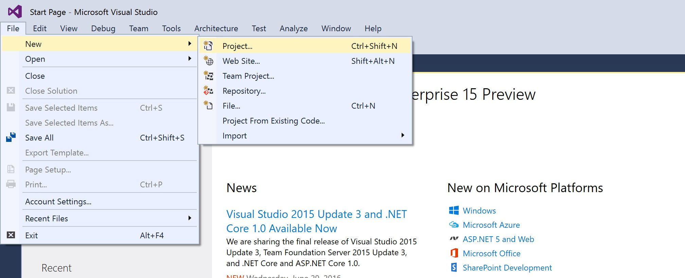

2. On the left navigation, select `Installed -> Templates -> Visual C# -> Web` and then choose the `ASP.NET Web Application` template. Don't worry about checking the box for Application Insights.  Give the project any name and click OK.

    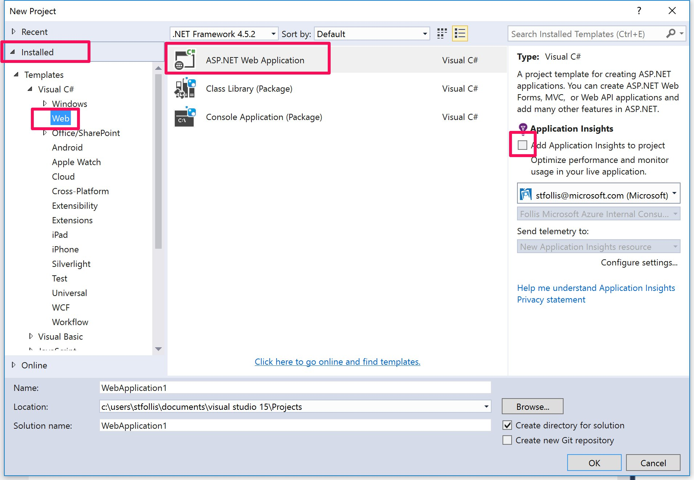

3. Select the MVC template, and do not check the Azure box.  We will do the site provisioning during the demo.  Click OK to scaffold out the solution.

    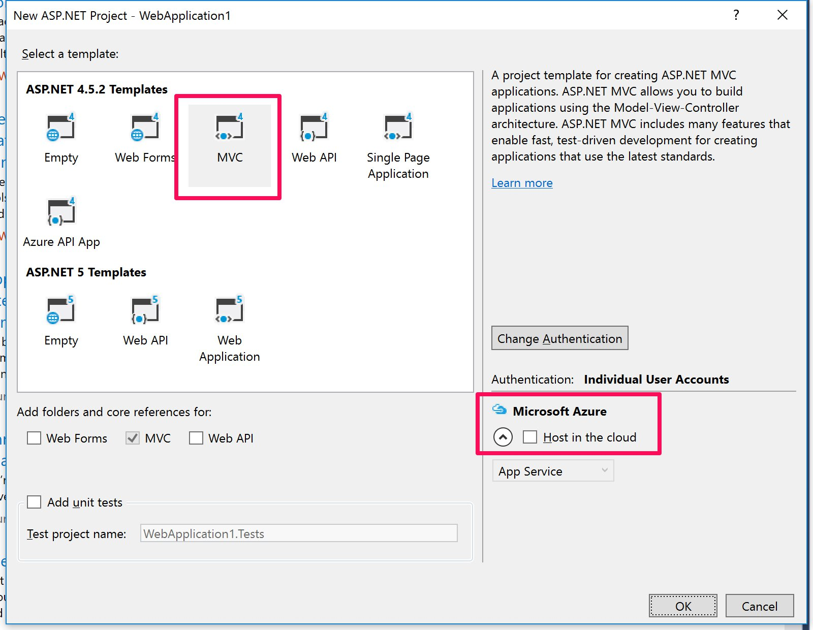

4. Once the solution provisions, hit F5 or click the green start arrow in the toolbar to ensure the app works locally.  

    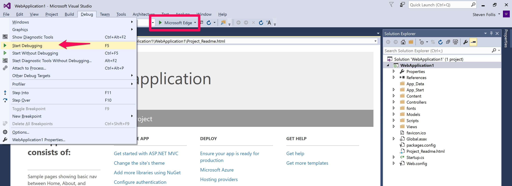

5. You now have a sample web application ready for deployment to the cloud during the demo.

    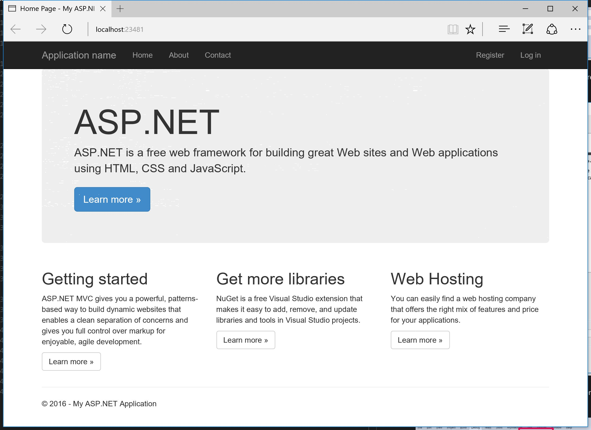

6. Open up a browser window and navigate to [http://portal.azure.com](http://portal.azure.com)

##  Demo Steps
*Estimated time: 10 minutes*

1. Starting from the portal, explain that we are going to spin up a brand new Azure Web App.  Click the "+" sign in the top left of the portal, then select `Web + Mobile` and finally `Web App`.  Explain that we could easily be provisioning a Mobile App or API App instead, via hovering on the tiles in the blade below Web App.

    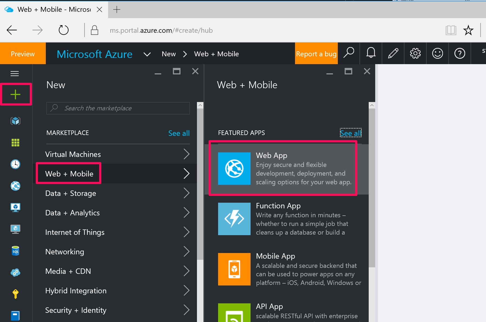

2. Give the application a globally unique name, and create a new Resource Group.

    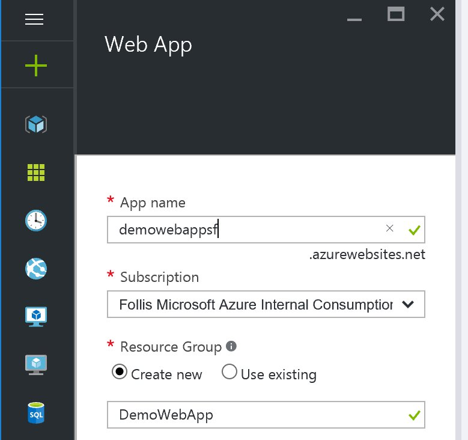

3. Create a new App Service Plan. Be sure to click "View All" on the Tier blade while calling out all the various options from Free to Premium, and how the features vary across the spectrum.  Emphasize that they can get going on a Free plan today, and scale up tomorrow to a larger plan as needed. Settle on a middle-of-the-road S1 Plan.

    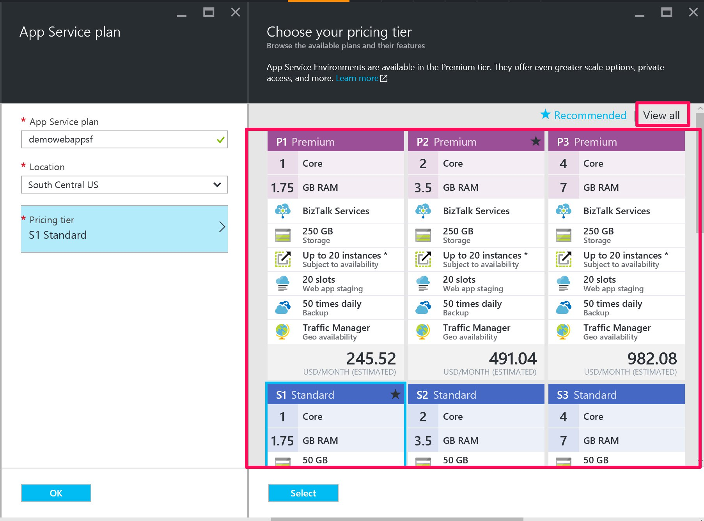

4. Complete the wizard and begin provisioning. This should take <60 seconds, during which ask the audience how long it takes to get a VM environment provisioned today for a web application.  When the process completes, open the new Resource Group and show the 3 new resources (Web App, App Service Plan, App Insights).  Mention that we'll be covering App Insights in depth in a future session.  Click the Web App to open its blade, then click "Browse" on the toolbar to pop the site in a new window. 

    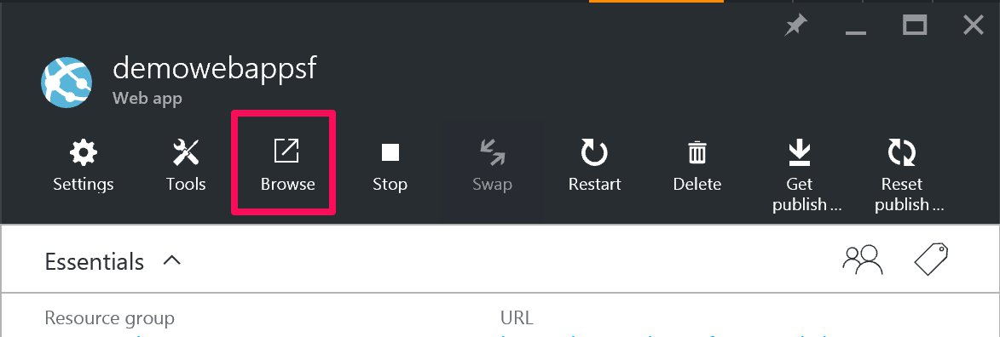

5. Explain that this URL is now accessible anywhere someone has the internet, all stood up in minutes. However, this landing page is not very appealing. We need to actually deploy code.

    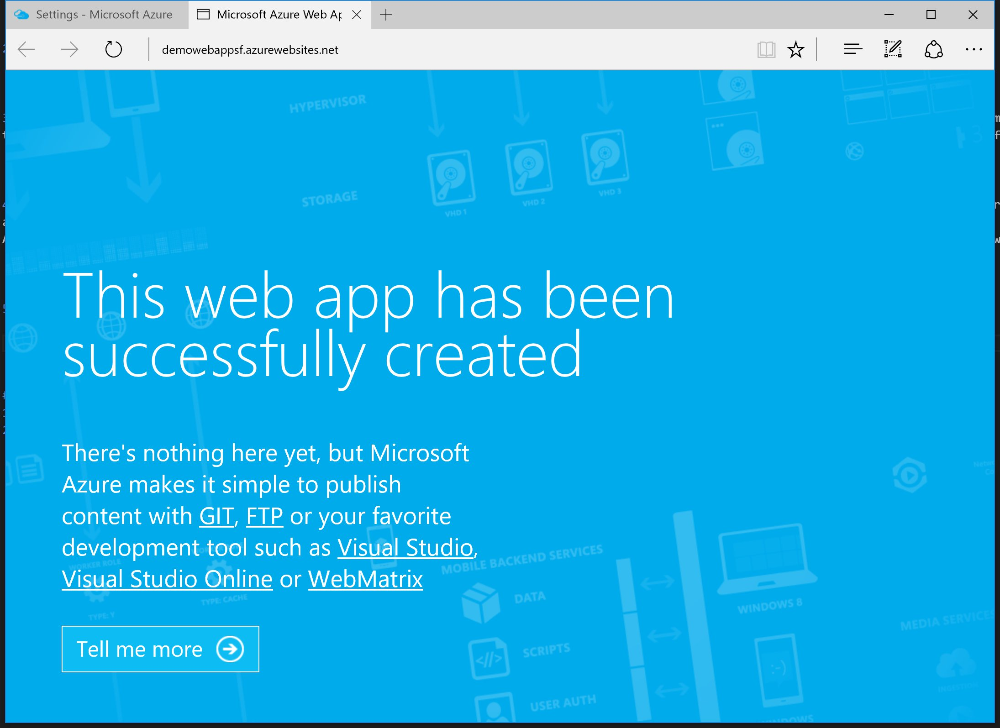

6. Flip back to Visual Studio, showing that we have a sample ASP.NET Web Application ready to go.  Feel free to show it running locally if desired.  

    

7. In the Visual Studio Solution Explorer, right click on the Project and click `Publish`

    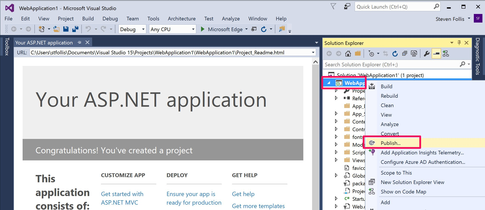

8. Select Azure App Service as the deployment target, then pick the Resourec Group and Web App that we previously provisioned. Click OK and execute a Publish.

    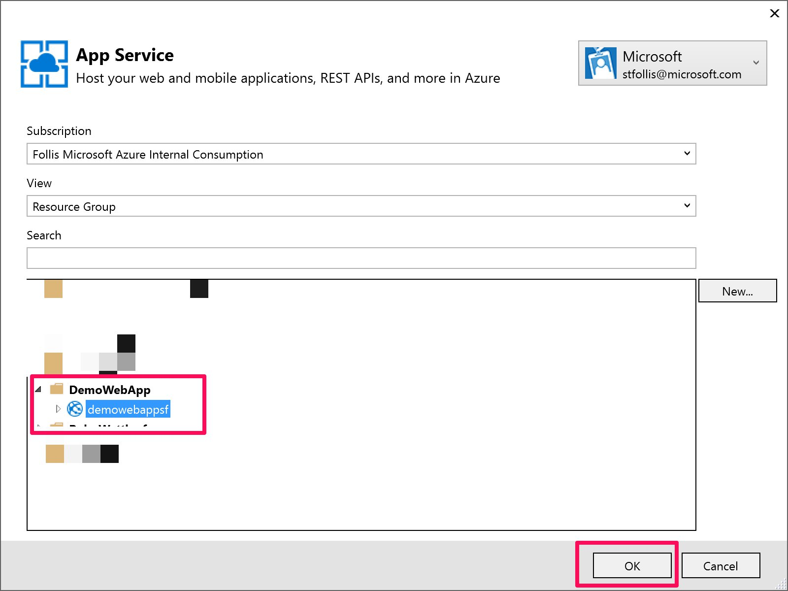

9. Publishing should take ~60 seconds, during which time discuss that while this demo uses an ASP.NET Web Application, we could easily be using ASP.NET WebAPI, Java, Node, or other web app technologies. Also discuss that while this initial publish is large, going forward the tooling will only be publishing small differentials, meaning very fast deployments.  Can also talk about the debugging experience in Visual Studio, and how Remote Debugging works with Azure Web Apps to allow developers to set breakpoints as expected to examine code running in the cloud.

    > Note: if you're on a slow connection, feel free to pre-publish this application to a second, "baked" resource group to speed up the demo

10. After showing our code running live in Azure, switch back to the Web App's blade in the portal to discuss the additional features of Azure App Service. 

11. Open the `Application Settings` blade. Discuss that this where we can begin configuring our web app, and that we have control over much of the functionality even though we are not running in a VM.  Show the different versions of .NET, PHP, and Java that are configurable.  Show the App Settings and Connection Strings sections, describing how we can load configuration into environmental variables instead of hard coding into web.config files.  

    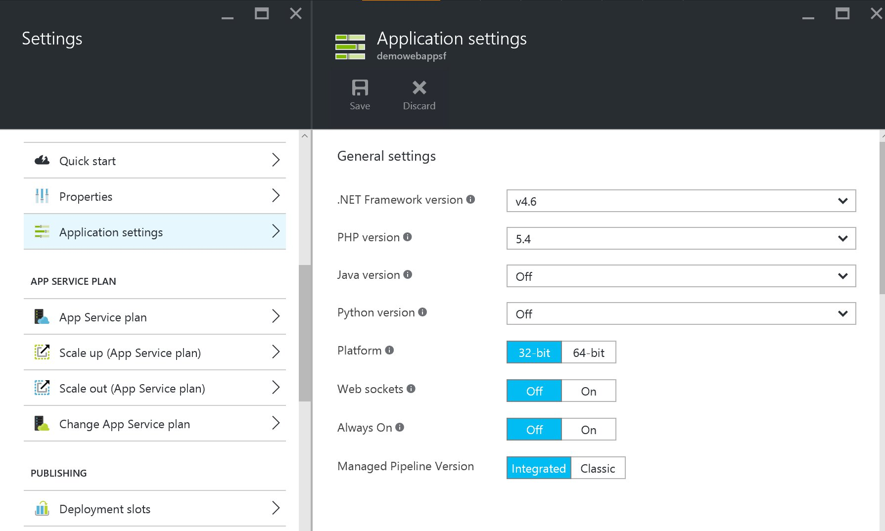

12. Opening the `Scale up` blade, select a different plan (Such as P1) and hit Select. This operation takes seconds, but allows you to scale up and down as required in a very flexible manner.  Wait for the toast to turn green notifying that the operation is finished. 

    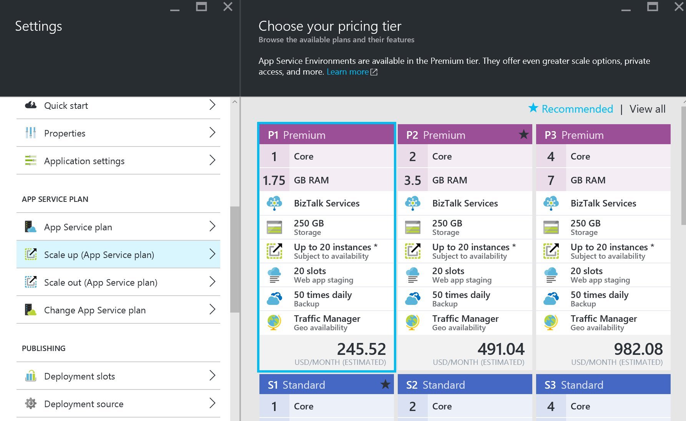

13. Next, describe that we can also scale out a PaaS web app. Select the `Scale out` blade, and configure it to use scale by CPU Percentage.  Explain that we want to never have less than 3 instances of our app, but never more than 10 instances.  We will fluidly scale up and down that range based on CPU range.  Anytime we get above 80%, let's pop a new instance. If we get down to a floor of 20%, then consolidate by removing an instance.  This allows us to automatically respond to changes in demand without manual interaction (which we can also handle).  This process can be done via API or Scripting, and when the scale operations occurwe can send alerts via email or webhooks to keep operations personnel informed. Click "Save" and wait for the green success toast notification. Should take <10 seconds to complete.

    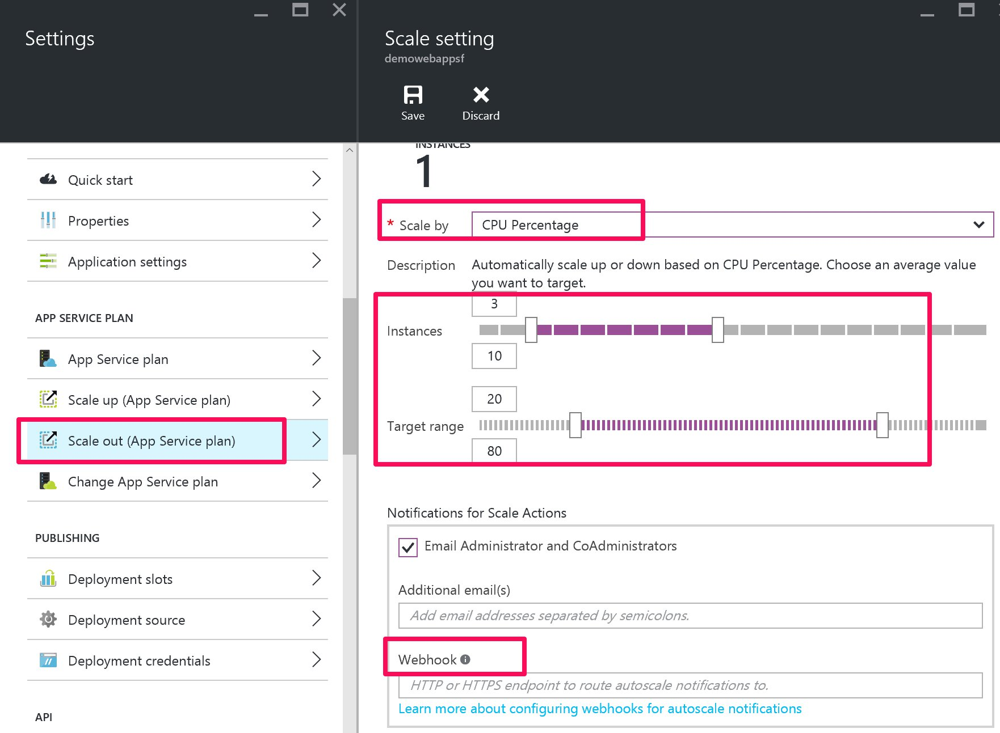

14. Next, move onto the CORS blade and set a new origin of "`*`".  Explain that a significant trend in web development today is using Single Page Applications, aka "SPA"s, built on top of massive JavaScript frameworks such as Angular, Ember, and related technologies such as React.  These frameworks depend on using JavaScript to query API's from the client side, however traditional API's have enforced a security boundary called [Cross-Origin Resource Sharing](https://en.wikipedia.org/wiki/Cross-origin_resource_sharing), aka "CORS".  If you have a legacy API wihout CORS enabled that your dev team wants to use with a SPA, it can mean code rewrites on an old code base, re-stabilization, re-deployment, etc.  In Web Apps we can control requests at the sandbox level, meaning you can deploy a legacy API into Azure App Service, then simply whitelist domains that are acceptable for CORS calls. With this feature you can easily deploy, scale, and secure such APIs, thus enabled your dev teams to use the latest technologies with minimal re-work.

    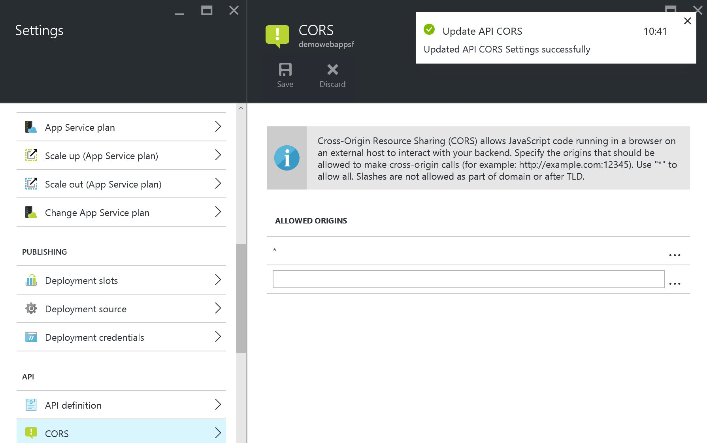

15. Speaking of security, it can be time intensive to build in authentication to web applications.  If you have an application on your intranet today, or a proof-of-concept that was not developed with security in mind then it can be difficult to migrate to public.  Similar to the CORS example, the App Service platform can help enforce security for a variety of scenarios.  Open the `Authentication` blade and describe how we can wrap a web app that has zero authentication code inside of a secure, AzureAD based container.  Once enabled, the web application will challenge all users for credentials.  If their credentials are not valid inside of AzureAD, aka they are not an employee, they will not be given access.  While App Service Authentication is less complex than hard coding authentication into an application, it does give a quick path to standing up security for a given app.  For the demo feel free to click OK and actually configure the security, then re-visit the web app in a second browser window using the Private Viewing mode to demonstrate the challenge for credentials.

    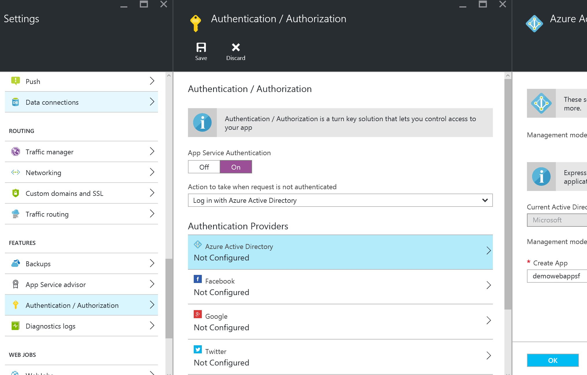

16. Wrapping up, discuss how you were able to easily take an application on your local machine and deploy it to public cloud infrastructure.  That once deployed, you can scale that application up and out, while taking advantage of several convenient features within the platform.  Azure App Service exists to decrease your management of applications, and allow you to get code into production faster than ever.

##  Clean Up
1. Delete the Resource Group from Azure containing the Web App and related resources
2. Delete the Visual Studio Solution from your local machine