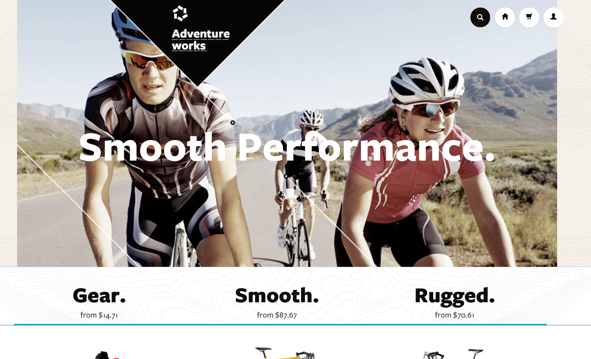
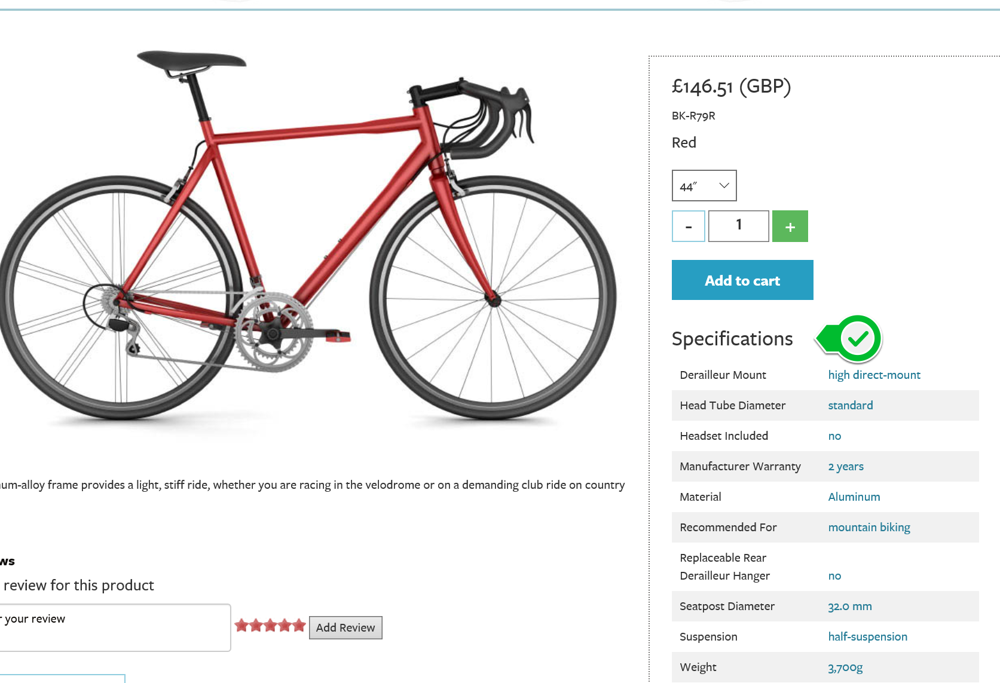
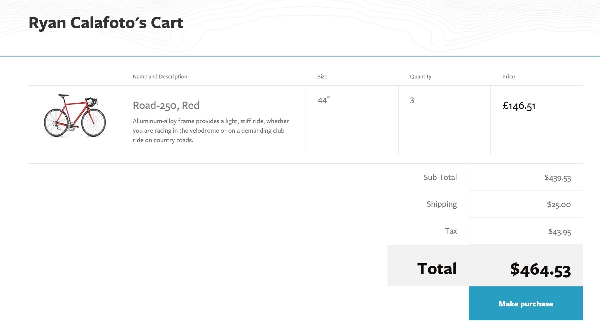

# Demo: Polyglot Persistence

## Pre-Requisites
None

## Setup
1. Open a browser 1.	Open a browser window and navigate to [http://docdbadventureworks.azurewebsites.net/](http://docdbadventureworks.azurewebsites.net/)

2. Setup Complete. Continue from Demo Steps

## Demo Steps
Estimated time: 10 minutes

1. Begin by explaining that an ecommerce site is a great example for showcasing the strengths of multiple types of data repositories

2. From the homepage, scroll down to the different products and show how the available products are very different from one another.  Clicking the bike, show how the specifications are unique to bicycles and unlike specifications for shoes. A document database is best suited for this are of the application, because flexibility is necessary across distinct product types.  Using a relational database would be very difficult, as we would have to create multiple columns unused by many products, full of null values.  Also as the product catalog evolves it would be difficult to update a relational table. Documents provide us with the flexibility needed.

3.	Set a quantity of 2 bikes and add them to your cart.  Viewing your cart, discuss how a simple key value database would be a good choice for simple storing of cart items.  It is a cheap and easy way to keep a running list of products to purchase.  However, upon checkout it’s important that the backend inventory system stays updated.  A relational database would be a good choice there, as it is the most robust with ACID transactions.  Getting out of sync between the application and backend system would be awful for business operations

4.	From the shopping cart click on the picture of the bike to go back to the product page.  Discuss that while it isn’t present, many ecommerce sites implement a suggested list of related items.  The system knows that “people who purchase red bikes often like to purchase blue shoes”.  This behavior is a great example of a graph database, which traces the relationship between items and users to show correlations.

5.	Clicking the Home button I the top right corner, summarize how while this site could have been created entirely in a relational database system, it would be difficult to maintain and scale.  Splitting components of the site into different data stores allows the application to leverage what each technology is “best” at and ensures a more scalable, cheaper solution.

## Clean Up
To clean up the demo simply close the browser tab
